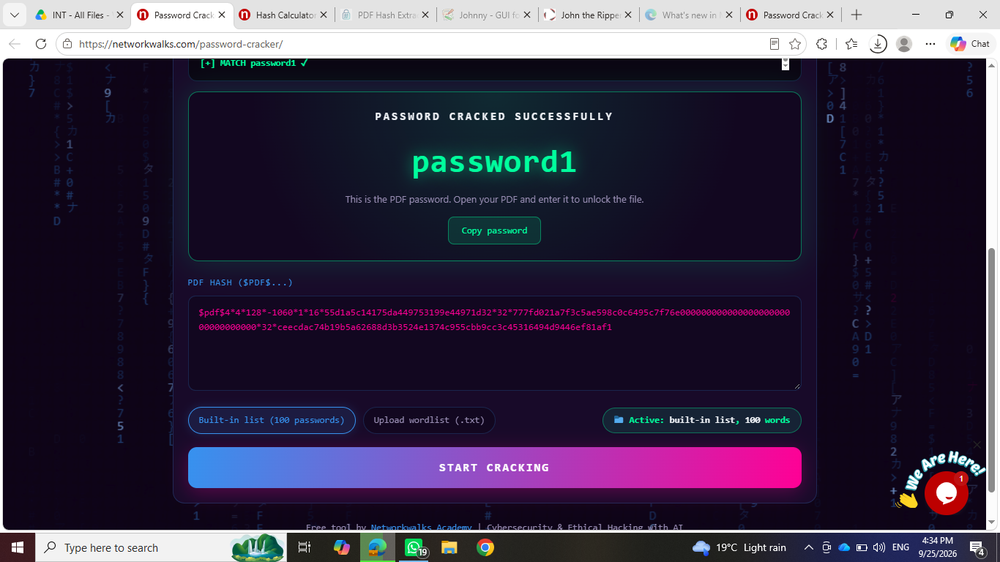
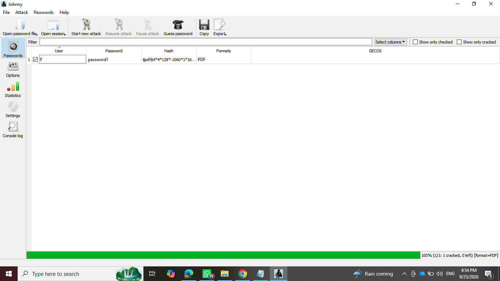

# 🔐 Project Overview

This project focuses on performing **password security testing, hash analysis, password recovery, and password auditing** using cybersecurity tools in Kali Linux.

The purpose of this project is to understand how password-protected files and password hashes can be analyzed and how password-auditing tools can be used to test password security in an authorized environment.

The activities were performed in a controlled cybersecurity learning environment as part of **Week 3 of the Cybersecurity & Ethical Hacking internship**.

---

## 🎯 Objectives

The main objectives of this project are to:

* Understand the concept of password security and password hashing.
* Understand how hash values are generated and analyzed.
* Perform hash calculation using a Hash Calculator.
* Work with a password-protected PDF file.
* Recover and verify the password of an authorized locked PDF.
* Understand the basic working of John the Ripper.
* Perform password auditing using John the Ripper.
* Understand how weak passwords can be identified through security testing.
* Practice password-security techniques in an authorized environment.
* Document the password-recovery and password-auditing activities.

---

## 🛡️ Purpose of the Project

The purpose of this project is to gain practical knowledge of **password security, hashing, password recovery, and password auditing**.

The tools and techniques practiced can be used for:

* Password security testing
* Hash analysis
* Password recovery
* Password auditing
* Identifying weak passwords
* Understanding password-protection mechanisms
* Security assessment and awareness

⚠️ **Important:** Password-recovery and password-auditing tools must only be used on files, systems, or credentials that you own or have explicit permission to test.

---

# 🏗️ Password Security Activities

During Week 3, different password-security activities were performed using a password-protected PDF, a Hash Calculator, and John the Ripper.

The following activities were completed:

| **#Tool / ActivityPurpose** |                    |                                              |
| --------------------------- | ------------------ | -------------------------------------------- |
| 1                           | Hash Calculator    | Hash calculation and hash analysis           |
| 2                           | Locked PDF         | Password recovery and verification           |
| 3                           | John the Ripper    | Password auditing and recovery               |
| 4                           | Final Unlocked PDF | Verification of successful password recovery |

---

# 🪜 Practical Activities

## Step 1. Hash Calculator

A **Hash Calculator** was used to calculate and analyze the hash information related to the password-security practical.

Hash values are generated from input data using a hashing algorithm and are commonly used in cybersecurity for integrity checking and password-security analysis.

### Purpose

The Hash Calculator was used to:

* Generate hash information.
* Analyze the resulting hash.
* Understand the relationship between hashes and password security.
* Support the password-recovery practical.

### Screenshot

**Hash Calculator**



---

## Step 2. Password-Protected PDF

A password-protected PDF file was used as part of the practical exercise.

The PDF was locked and required the correct password to access its contents.

The password-recovery process was performed in the authorized internship laboratory environment.

### Purpose

The purpose of this activity was to understand:

* How password-protected files work.
* How password information can be analyzed.
* How password recovery can be performed in an authorized environment.
* How recovered credentials can be verified.

---

## Step 3. John the Ripper

**John the Ripper** was used for password auditing and password recovery.

John the Ripper is a password-security auditing tool that can be used to test password strength by attempting to recover passwords from password-related information.

### Purpose

John the Ripper was used to:

* Perform password-security testing.
* Attempt password recovery.
* Understand password-cracking techniques.
* Identify weak passwords in an authorized environment.
* Gain practical experience with a commonly used cybersecurity tool.

### Screenshot

**John-Johnny**



---

## Step 4. Password Verification and Final Unlock

After the password-recovery process, the identified password was tested against the protected PDF.

The password was successfully verified and the PDF was unlocked.

### Result

The protected PDF was successfully opened after entering the recovered password.

### Screenshot

**Final-Unlocked**


---

# 🔬 Tools Used

The following tools and resources were used during the project:

```text
Hash Calculator
John the Ripper
Kali Linux
Terminal
Password-Protected PDF

```

---

# 💡 What I Learned

Through this project, I learned how password-security tools can be used to analyze and test passwords in an authorized cybersecurity environment.

### 1. Password Hashing

I learned that hashing converts input data into a fixed-length hash value using a hashing algorithm.

Hashing is an important concept in cybersecurity and is commonly used when handling password-related data.

### 2. Hash Analysis

Using the Hash Calculator, I learned how hash information can be generated and examined during a password-security exercise.

This helped me understand how hashes are used in security-related applications.

### 3. Password Recovery

I learned how password recovery can be performed on an authorized password-protected file.

I also learned the importance of verifying a recovered password before considering the recovery process successful.

### 4. John the Ripper

Using **John the Ripper**, I learned about password-auditing techniques and how a security professional can test the strength of passwords.

### 5. Password Security

This practical helped me understand why weak and predictable passwords can create security risks.

Strong and unique passwords are important for protecting files, accounts, and systems.

### 6. Ethical Password Testing

I learned that password-cracking and password-recovery tools should only be used with proper authorization.

These tools can be useful for security testing, but unauthorized access to passwords or protected files is not permitted.

---

# 📸 Project Screenshots

The screenshots included in this repository are:

1. `John-johnny.png` - John the Ripper password-auditing practical
2. `Hash-calculator.png` - Hash calculation and analysis
3. `Final-unlocked.png` - Successfully unlocked password-protected PDF

---

# 🔐 Security & Ethical Use

This project was performed for **educational and authorized cybersecurity training purposes**.

Password-recovery and password-auditing tools should only be used against files, systems, accounts, or credentials where proper authorization has been provided.

Unauthorized password cracking, credential access, or attempts to bypass security controls may violate organizational policies and applicable laws.

The techniques demonstrated in this project were performed as part of the **Cybersecurity & Ethical Hacking internship laboratory activities**.

---

# 📝 Conclusion

During Week 3 of my Cybersecurity & Ethical Hacking internship, I completed practical activities covering **hash calculation, password analysis, password recovery, and password auditing**.

I worked with a **Hash Calculator** to understand hash-related information and performed a password-recovery exercise using a protected PDF.

I also practiced using **John the Ripper** for password auditing and recovery in an authorized laboratory environment.

Finally, I verified the recovered password by successfully unlocking the protected PDF.

These activities helped me develop a better understanding of **password security, hashing, password recovery, and ethical password auditing** and provided practical experience with cybersecurity tools used for security testing.

---

# 🔗 Tools & Resources

* **Kali Linux:** https://www.kali.org/
* **John the Ripper:** https://www.openwall.com/john/
* **John the Ripper GitHub:** https://github.com/openwall/john
* **Hashing Concepts:** https://www.kali.org/tools/

---

# 👤 Author

**Sahara Nagarkoti**

**Batch:** B083E
**Program:** Cybersecurity & Ethical Hacking Internship
**Week:** 03
**Date:** September 25, 2026

---

# 📌 Project Information

**Program Name:** Cybersecurity & Ethical Hacking Internship
**Week:** 03
**Project:** Password Security, Hash Analysis & Password Recovery
**Batch:** B083E
**Author:** Sahara Nagarkoti
**Date:** September 25, 2026
